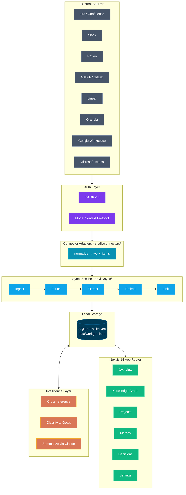
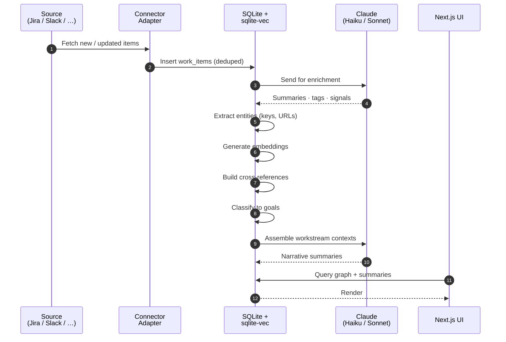

<div align="center">

# WorkGraph

### Local-first work intelligence — your tickets, docs, meetings, and chat, unified.

[](LICENSE)
[](https://github.com/pyalwin/workgraph/pulls)
[](https://github.com/pyalwin/workgraph/stargazers)
[](https://nextjs.org/)
[](https://anthropic.com/)

[**Quickstart**](#-quickstart) · [**Features**](#-features) · [**Architecture**](#-architecture) · [**Connectors**](#-connectors) · [**Contributing**](#-contributing)

</div>

---

## Why WorkGraph

You probably ship work that lives across a dozen tools. A Jira ticket, a Notion design doc, a Slack thread debating it, a Granola meeting where the call was made, a GitHub PR that landed it. The signal is everywhere; the picture is nowhere.

**WorkGraph stitches those scattered artifacts back into the thing they actually were: one piece of work.** Every connector runs against your account. Every byte of data lives on your laptop. Every embedding is computed, stored, and queried locally. The only outbound traffic is to the source APIs you choose and to Anthropic for summarization.

This project is **100% open source** under the [MIT License](#-license). Fork it, run it, extend it, or just read the code to see how it works.

---

## Table of Contents

- [Features](#-features)
- [Architecture](#-architecture)
- [Tech Stack](#-tech-stack)
- [Quickstart](#-quickstart)
- [Configuration](#-configuration)
- [Connectors](#-connectors)
- [Modules](#-modules)
- [CLI Scripts](#-cli-scripts)
- [Project Structure](#-project-structure)
- [Data Flow](#-data-flow)
- [Privacy & Security](#-privacy--security)
- [Roadmap](#-roadmap)
- [Contributing](#-contributing)
- [License](#-license)
- [Acknowledgments](#-acknowledgments)

---

## Features

- **Multi-source ingest.** Eleven connectors out of the box: Jira, Confluence, Notion, Slack, GitHub, GitLab, Linear, Granola, Google Calendar, Google Drive, Microsoft Teams.
- **Cross-referencing.** Items are linked by issue keys, URL matches, title similarity, and vector neighbors — so a meeting transcript automatically connects to the ticket it was about.
- **Goal classification.** Define strategic goals; items are tagged automatically using keywords plus embeddings.
- **Workstream summaries.** Connected components in the graph become workstreams, narrated by Claude Sonnet.
- **Decision extraction.** First-class detection of decisions made vs. decisions still open, pulled from threads and meetings.
- **Knowledge graph viz.** Pan, zoom, and click through a force-directed network of items and links.
- **Project pages.** Per-project health snapshots, ticket lists, velocity, and Haiku-generated daily summaries.
- **Metrics dashboard.** Cross-source velocity, cycle time, deployment frequency, adoption charts.
- **OAuth + MCP.** Secure OAuth 2.0 flows for SaaS sources, plus Model Context Protocol support for Claude-native tools.
- **Local-first.** SQLite + sqlite-vec. Encrypted token storage. No analytics, no telemetry, no cloud.

---

## Architecture



---

## Tech Stack

| Layer | Choice |
|---|---|
| Framework | [Next.js 14](https://nextjs.org/) (App Router) + [React 18](https://react.dev/) |
| Language | [TypeScript 5](https://www.typescriptlang.org/) |
| Storage | [SQLite](https://sqlite.org/) via [`better-sqlite3`](https://github.com/WiseLibs/better-sqlite3) + [`sqlite-vec`](https://github.com/asg017/sqlite-vec) for vector search |
| LLM | [Anthropic Claude](https://anthropic.com/) (Opus, Sonnet, Haiku) |
| Tool integration | [Model Context Protocol](https://modelcontextprotocol.io/) |
| UI | [Tailwind CSS](https://tailwindcss.com/) + [Radix UI](https://www.radix-ui.com/) primitives |
| Graph viz | [`react-force-graph-2d`](https://github.com/vasturiano/react-force-graph) |
| Markdown | [`react-markdown`](https://github.com/remarkjs/react-markdown) + [`remark-gfm`](https://github.com/remarkjs/remark-gfm) |
| Runtime | Node 20+ / [Bun](https://bun.sh/) |

---

## Quickstart

### Prerequisites

- Node.js 20+ or Bun 1.x
- An [Anthropic API key](https://console.anthropic.com/)
- OAuth credentials for whichever sources you want to connect (optional — you can start with just MCP-backed sources)

### 1. Clone and install

```bash
git clone https://github.com/pyalwin/workgraph.git
cd workgraph
bun install
# or: npm install
```

### 2. Configure environment

Create `.env.local` in the project root:

```bash
# Required — Claude API for summaries, classification, decision extraction
ANTHROPIC_API_KEY=sk-ant-...

# Required — encryption key for stored OAuth tokens
WORKGRAPH_SECRET_KEY=<generate with: bun scripts/gen-secret.ts>

# Required — base URL for OAuth redirects (must match provider apps)
OAUTH_REDIRECT_BASE_URL=http://localhost:3000
```

### 3. Initialize the database

```bash
bun scripts/init-db.ts
```

Idempotent — safe to re-run any time.

### 4. Start the dev server

```bash
bun dev
```

Open <http://localhost:3000>, wire up connectors under **Settings**, and run your first sync.

---

## Configuration

| Variable | Required | Description |
|---|---|---|
| `ANTHROPIC_API_KEY` | yes | Claude API key — used for enrichment, summaries, decisions, classification |
| `WORKGRAPH_SECRET_KEY` | yes | 32-byte hex key (AES-GCM) for encrypting OAuth tokens at rest |
| `OAUTH_REDIRECT_BASE_URL` | yes | Public-facing base URL for OAuth callbacks (e.g. `http://localhost:3000`) |

Per-connector OAuth client IDs and secrets are configured in the **Settings → Connectors** UI and stored encrypted in the database.

---

## Connectors

| Source | Auth | Adapter |
|---|---|---|
| Jira / Confluence | OAuth (Atlassian) | [`atlassian.ts`](src/lib/connectors/adapters/atlassian.ts) |
| Confluence (standalone) | OAuth | [`confluence.ts`](src/lib/connectors/adapters/confluence.ts) |
| Notion | OAuth | [`notion.ts`](src/lib/connectors/adapters/notion.ts) |
| Slack | OAuth | [`slack.ts`](src/lib/connectors/adapters/slack.ts) |
| GitHub | OAuth | [`github.ts`](src/lib/connectors/adapters/github.ts) |
| GitLab | OAuth | [`gitlab.ts`](src/lib/connectors/adapters/gitlab.ts) |
| Linear | OAuth | [`linear.ts`](src/lib/connectors/adapters/linear.ts) |
| Granola (meetings) | MCP | [`granola.ts`](src/lib/connectors/adapters/granola.ts) |
| Google Calendar | OAuth | [`gcal.ts`](src/lib/connectors/adapters/gcal.ts) |
| Google Drive | OAuth | [`gdrive.ts`](src/lib/connectors/adapters/gdrive.ts) |
| Microsoft Teams | OAuth | [`teams.ts`](src/lib/connectors/adapters/teams.ts) |

Adding a new source means implementing one adapter — see [`src/lib/connectors/types.ts`](src/lib/connectors/types.ts) for the contract.

---

## Modules

The dashboard is split into focused modules, each backed by its own routes and queries:

### Overview (`/`)
At-a-glance summary of recent activity, open decisions, and stale items.

### Knowledge Graph (`/knowledge`)
Interactive force-directed graph of items and their links. Filter by source, type, goal, or workstream.

### Projects (`/projects`)
Per-project pages with health snapshots, ticket lists, velocity charts, and Claude Haiku-generated summaries (cached daily, refreshable on demand).

### Metrics (`/metrics`)
Cross-source velocity, cycle time, deployment frequency, and adoption charts.

### Decisions
First-class extraction and classification of "decided" vs. "asked-but-not-shipped" moments from threads and meetings.

### Workstreams
Connected components in the graph, surfaced as a single coherent narrative written by Claude Sonnet.

### Settings (`/settings`)
Connector management, OAuth flows, sync triggers, and workspace configuration.

---

## CLI Scripts

All scripts live in `scripts/` and run via `bun scripts/<name>.ts` (or `tsx scripts/<name>.ts`).

| Script | Purpose |
|---|---|
| `init-db.ts` | Create / migrate the schema (idempotent) |
| `gen-secret.ts` | Generate a `WORKGRAPH_SECRET_KEY` |
| `sync-jira.ts` · `sync-slack.ts` · `sync-notion.ts` · `sync-github.ts` · `sync-gmail.ts` · `sync-meetings.ts` | Per-source sync |
| `sync-mcp.ts` | Sync via active MCP tools |
| `process.ts` | Run the full pipeline (enrich → extract → embed → link → classify) |
| `run-sync.sh` | Orchestrator that runs all syncs end-to-end |
| `assemble-reingest.ts` | Rebuild workstreams from current items |
| `*-validate.ts` | Sanity checks for each pipeline stage |
| `orphan-diag.ts` | Find items with no cross-references |

---

## Project Structure

```
workgraph/
├── src/
│   ├── app/                  Next.js routes (UI + API)
│   │   ├── api/              REST endpoints (sync, graph, search, oauth, …)
│   │   ├── knowledge/        Graph visualization
│   │   ├── projects/         Projects index + detail
│   │   ├── metrics/          Metrics dashboard
│   │   └── settings/         Connector + workspace management
│   ├── components/           Reusable UI (Radix + Tailwind)
│   ├── lib/
│   │   ├── connectors/       Source adapters + sync orchestrator
│   │   ├── sync/             Ingest, enrich, extract, cleanup
│   │   ├── chunking/         Per-source content chunkers
│   │   ├── embeddings/       Embedding generation (Anthropic / Ollama)
│   │   ├── decision/         Decision extraction + summarization
│   │   ├── workstream/       Workstream assembly + narrative
│   │   ├── oauth/            OAuth provider definitions, tokens, refresh
│   │   ├── modules/          Pluggable dashboard modules
│   │   ├── crossref.ts       Multi-signal item linking
│   │   ├── classify.ts       Goal classification
│   │   ├── metrics.ts        Snapshot computation
│   │   └── schema.ts         SQLite schema + migrations
│   └── styles/
├── scripts/                  CLI tools (sync, validate, maintenance)
├── data/                     Local SQLite DB and seed files (gitignored)
└── docs/                     Specs and implementation plans
```

---

## Data Flow



1. **Sync** — A connector adapter fetches new/updated items from a source and writes them to `work_items` (deduped by `(source, source_id)`).
2. **Enrich** — Claude Haiku adds summaries, tags, and authorship signals.
3. **Extract entities** — Issue keys, URLs, mentions, and dates are pulled into a structured form.
4. **Embed** — Each item (and its chunks) gets a vector embedding stored in `sqlite-vec`.
5. **Link** — `crossref.ts` builds edges in the `links` table from explicit references (e.g. `PEX-123`), URL matches, title similarity, and vector neighbors.
6. **Classify** — Items are assigned to user-defined goals using keywords + embeddings.
7. **Assemble** — Connected components become workstreams; Claude Sonnet writes a narrative for each.
8. **Surface** — The UI queries this graph for the overview, knowledge view, project pages, and metrics.

Every step is incremental and resumable — re-running any phase only touches what's new or changed.

---

## Privacy & Security

- **Local-first by design.** The database is a single SQLite file under `data/`. It never leaves your machine.
- **Encrypted tokens.** OAuth tokens are encrypted at rest with `WORKGRAPH_SECRET_KEY` (AES-256-GCM via [`src/lib/crypto.ts`](src/lib/crypto.ts)).
- **No analytics, no telemetry.** This project does not phone home, ever.
- **Outbound traffic.** Only to (a) source APIs you've explicitly connected and (b) the Anthropic API for summaries and classification.
- **Open code.** Every line is in this repo — audit it yourself.

---

## Roadmap

- [ ] Self-hosted deployment guide (Docker + reverse proxy)
- [ ] Local embeddings via Ollama (currently optional, becoming default)
- [ ] Plugin API for community-contributed connectors
- [ ] Export to Markdown / Obsidian
- [ ] Mobile-friendly UI
- [ ] CI / GitHub Actions

Have an idea? [Open an issue](https://github.com/pyalwin/workgraph/issues/new) or [start a discussion](https://github.com/pyalwin/workgraph/discussions).

---

## Contributing

**Contributions are very welcome.** WorkGraph is open source under MIT and built to be hacked on.

### How to contribute

1. **Fork** the repo and create a feature branch (`git checkout -b feat/your-feature`).
2. **Build something.** Add a connector, fix a bug, improve the UI, write docs.
3. **Commit** with a clear message (the project follows conventional-ish prefixes like `feat:`, `fix:`, `docs:`, `chore:`).
4. **Open a pull request** against `main`. Describe what changed and why.

### Good first issues

- Adding a new connector — pick a source not yet in [the list](#-connectors), implement the adapter contract.
- Improving chunking strategies for long documents.
- Adding tests (the project is currently test-light by design — help us change that).
- UI polish in any module.

### Code style

- TypeScript everywhere, strict mode.
- Prefer small, focused functions over deep abstractions.
- Server logic in `src/lib/`, UI in `src/components/` and `src/app/`.
- Run `next lint` before pushing.

### Reporting bugs

Open an [issue](https://github.com/pyalwin/workgraph/issues/new) with:
- What you expected to happen
- What actually happened
- Steps to reproduce
- Your environment (Node/Bun version, OS)

---

## License

This project is licensed under the **MIT License** — see the [LICENSE](LICENSE) file for the full text.

```
Copyright (c) 2026 Arun Venkataramanan

Permission is hereby granted, free of charge, to any person obtaining a copy
of this software and associated documentation files (the "Software"), to deal
in the Software without restriction…
```

You're free to use, copy, modify, merge, publish, distribute, sublicense, and sell copies — for any purpose, commercial or otherwise.

---

## Acknowledgments

Built on the shoulders of giants:

- [Anthropic](https://anthropic.com/) for Claude and the Model Context Protocol.
- [Vercel](https://vercel.com/) for Next.js.
- [Alex Garcia](https://github.com/asg017) for `sqlite-vec` — the reason this whole thing fits in a single SQLite file.
- [Vasco Asturiano](https://github.com/vasturiano) for `react-force-graph`.
- The maintainers of every package in [`package.json`](package.json).

---

<div align="center">

**If WorkGraph is useful to you, consider [starring the repo](https://github.com/pyalwin/workgraph) — it helps others find it.**

Made with care by [Arun Venkataramanan](https://github.com/pyalwin) · MIT Licensed · Built to be forked

</div>
